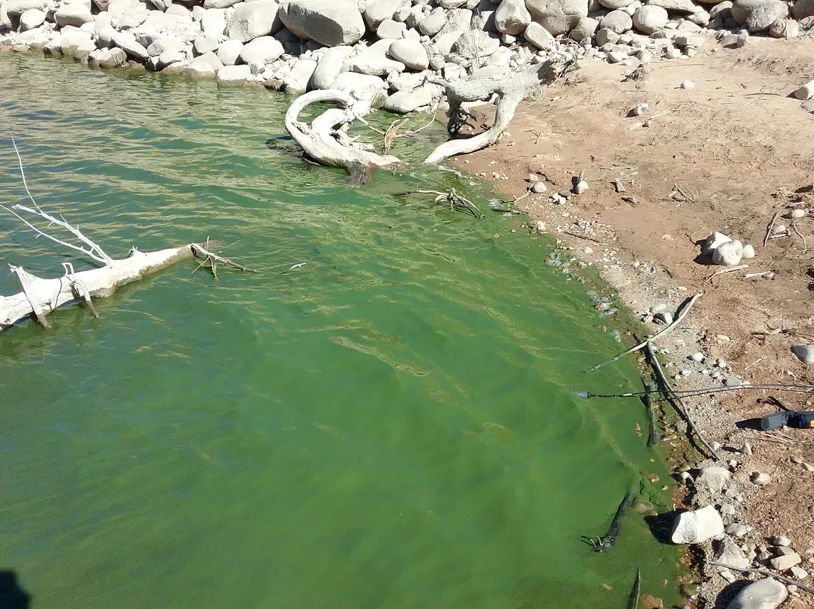
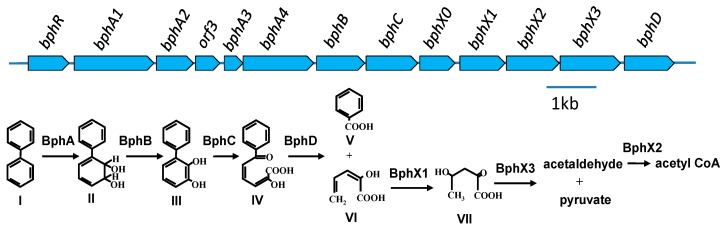
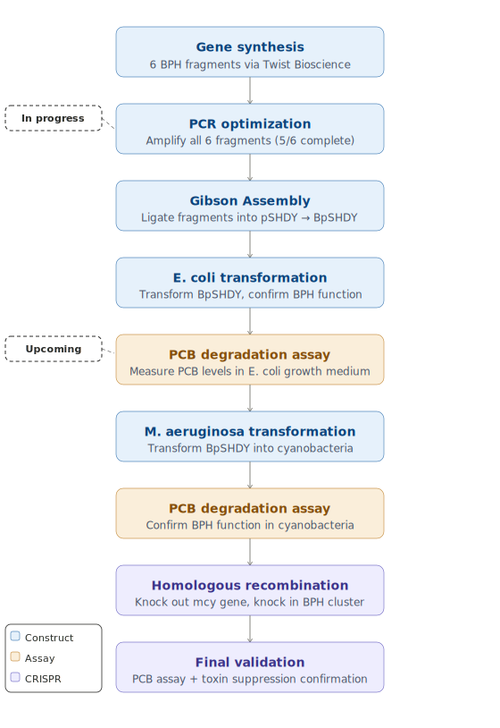

Engineering Cyanobacteria to Degrade PCBs

<nav class="research-nav">

Projects

<a class="active" href="research-bph.html">PCB Degradation</a>
<a href="research-mars.html">Mars Habitation</a>
<a href="research-phylo.html">Lab Experience & Projects</a>
</nav>

## Background

Harmful algal blooms (HABs) present a danger to marine ecosystems, plant life, and human health and are present all throughout the world. Utah Lake is one of the many water systems impacted by HABs and is known to contain the microcystin (mcy) toxin attributed to the cyanobacteria *Microcystis aeruginosa*. The eutrophication of Utah Lake has created a local health risk, killing the local fish and risking the health of humans and other animals and has transformed a once popular recreation site into a danger zone. In addition, there are other pollutants found within the water that present health risks to the ecosystem including the organic compound polychlorinated biphenyls (PCBs). PCBs are highly stable compounds that can take decades to naturally degrade and remain in the lake water despite the use of PCBs being banned in the US in 1979. 

The motivation for this project is to improve the ecosystem of Utah Lake, its plant and aquatic life, and to restore its renown as a place of recreation. A biological solution targeting both problems simultaneously may be possible through engineering the cyanobacteria themselves.

## Approach

Soil bacteria isolated in Japan have been found to contain a biphenyl (BPH) gene cluster capable of breaking PCBs down to Acetyl-CoA through a series of enzymatic steps. As shown in the figure below, the cluster encodes a multi-component dioxygenase (bphA1-A4) that initiates oxygenation of biphenyl, followed by a dehydrogenase (bphB), a ring-cleavage dioxygenase (bphC), and a hydrolase (bphD) that yields benzoic acid and a five-carbon acid. The downstream bphX genes complete the degradation to Acetyl-CoA, feeding directly into central metabolism.

This project uses CRISPR to knock out the mcy toxin-producing gene in *M. aeruginosa* and knock in the BPH gene cluster, simultaneously inhibiting toxin production and conferring PCB breakdown function to the cyanobacterium.

<figure style="margin: 24px 0;">

<figcaption style="text-align:center; font-size:0.85em; color:#6b7280; margin-top:8px;">
Biphenyl/PCB degradation pathway and bph gene cluster organization. 
Figure 1 from Kimura et al. (2019), <em>Genes</em> 10(5), 404. 
<a href="https://pmc.ncbi.nlm.nih.gov/articles/PMC6563109/" target="_blank" rel="noopener">https://doi.org/10.3390/genes10050404</a>. 
Licensed under CC BY 4.0.
</figcaption>
</figure>

<figure style="margin: 24px 0;">

<figcaption style="text-align:center; font-size:0.85em; color:#6b7280; margin-top:8px;">Experimental Design Overview: Blue - Construct Building, Amber - Functional Assays, Purple - CRISPR Integration</figcaption>
</figure>

## Current Work

The BPH gene cluster has been synthesized by Twist Bioscience and delivered in fragments. Currently, the fragments are going through PCR optimization for use in ligation via Gibson Assembly into a cyanobacteria vector pSHDY. There are 6 fragments in total and 5/6 have been completed and are ready for the final amplification. The last fragment to be amplified, which is the first fragment of the cluster, has proven to require the most work and this is likely due to the sequence length that needs to overlap with the vector. This lengthened overlap has caused non-specific binding and produced extra bands, which has required a lengthier optimization process.

## Future Directions

Upon completion of PCR optimization, each fragment will be amplified and then ligated into pSHDY using Gibson Assembly. The newly constructed plasmid, named BpSHDY, will be transformed in *E. coli* to test the function of the BPH gene by inoculating growth medium with a known concentration of PCBs and regularly measuring the levels of PCB concentration. Further, maintained cultures of *M. aeruginosa* will be transformed to carry BpSHDY and water samples will be inoculated with PCBs and, again, the PCB concentration levels will be measured to ensure a functional gene. Finally, homologous arms will be designed to knock out the mcy gene and knock in the BPH gene cluster, with the newly engineered *M. aeruginosa* going through another PCB degradation assay in water samples.

