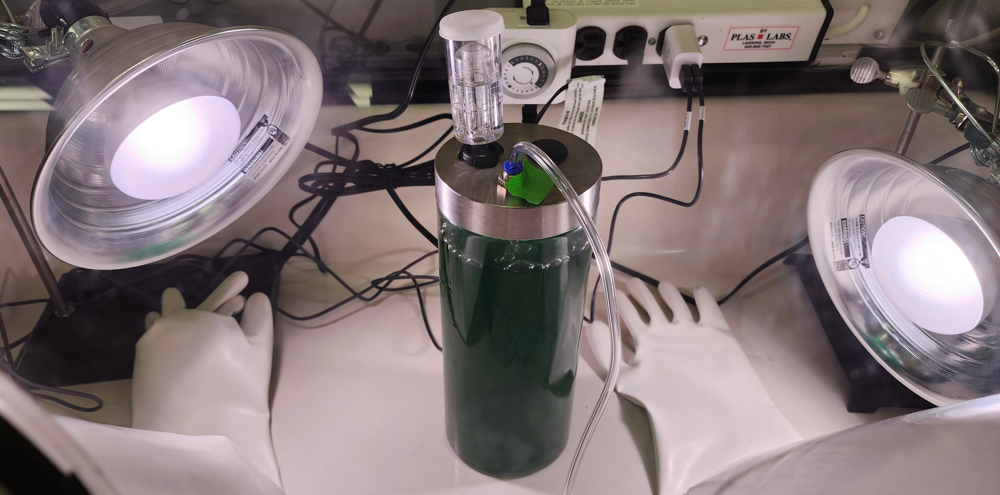
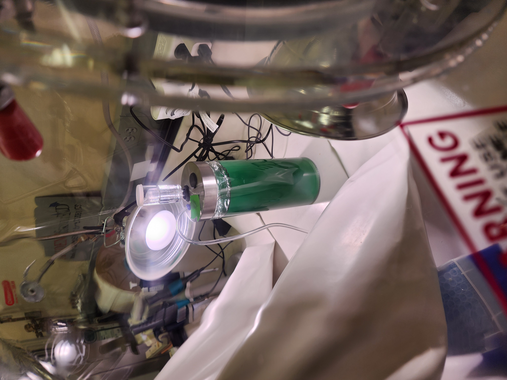
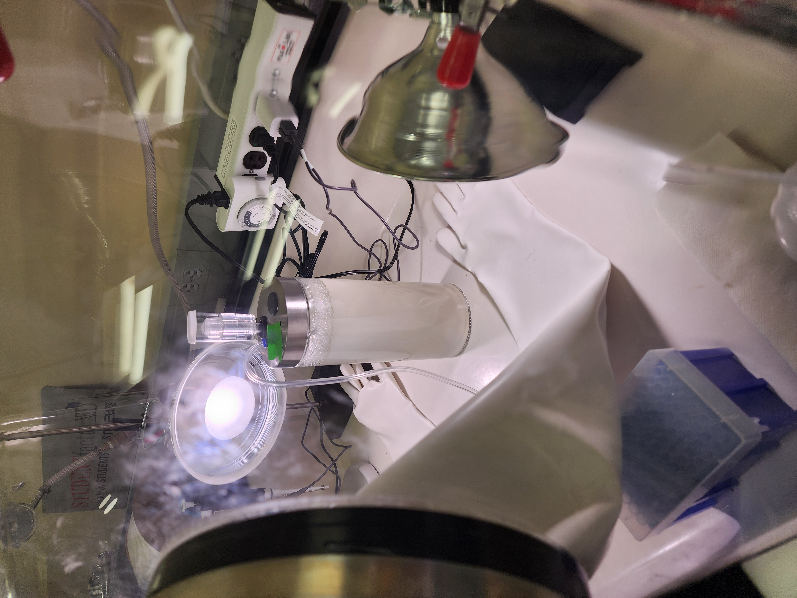

Cyanobacterial Oxygen Production Under Simulated Mars Conditions

<nav class="research-nav">

Projects

<a href="research-bph.html">PCB Degradation</a>
<a class="active" href="research-mars.html">Mars O2 Production</a>
<a href="research-phylo.html">Lab Experience & Projects</a>
</nav>

## Background

Exoplanetary terraforming is becoming less science fiction and more a near-future endeavor. Cyanobacteria were the primary drivers of the Great Oxidation Event, producing the oxygen that transformed Earth's atmosphere into one capable of supporting complex life. Beyond oxygen production, their versatility, spanning food production, soil development, and waste management, makes them a strong candidate for planetary habitability efforts. Understanding the limitations of cyanobacterial oxygen production is a key step in making planetary expansion a possibility. With the recent public interest in Mars colonization, this project looks to grow cyanobacteria in a photobioreactor under Mars-like conditions to determine if the cyanobacteria can produce oxygen from a dense carbon dioxide environment.

## Approach

The cyanobacterium selected to test was *Nostoc muscorum* as it has been shown to be a candidate for oxygen production, food production, soil/regolith development, water and waste management, and research into radiation and UV resistance. A sample of *N. muscorum* was grown in BG-11 medium to saturation, and then transferred to a large photobioreactor. The photoreactor was then placed into an anaerobic chamber containing oxygen and carbon dioxide sensors. The chamber was then purged of oxygen, confirmed by the O2 sensor, and back-filled with 98% food grade CO2. A lamp set to a diurnal cycle simulated light/dark cycling conditions. Oxygen and CO2 levels were automatically logged by the sensors and were measured for 4 weeks.

## Results

Ultimately, this project resulted in readings that were indeterminate. The sensors had a maximum detection threshold of 100,000 ppm CO2; since the chamber was back-filled with 98% CO2 (approximately 980,000 ppm), the sensors were saturated from the outset and could not have detected any decline even if CO2 was being consumed. The culture gradually turned from deep green to white over the course of the experiment. While initial discoloration could be attributed to photobleaching from the lamp, the most likely explanation is that the culture died under the extreme CO2 conditions.

<figure class="comparison-img">

<figcaption>Day 0 — <em>N. muscorum</em> culture, deep green</figcaption>
</figure>
<figure class="comparison-img">

<figcaption>Week 4 — culture bleached white under extreme CO₂ conditions</figcaption>
</figure>

## Future Directions

This result provided insight on variables to include and control for a follow up procedure. Rather than completely filling the chamber with CO2, the amount of CO2 will be monitored to ensure it's within a detectable range. Placement of the lamp can also be adjusted to reduce the possibility of the culture bleaching. Additionally, photosynthetic CO2 consumption reduces dissolved carbonic acid, raising solution pH. If the culture was actively photosynthesizing, the resulting alkaline shift may have contributed to culture death. pH monitoring will be included in future runs.

