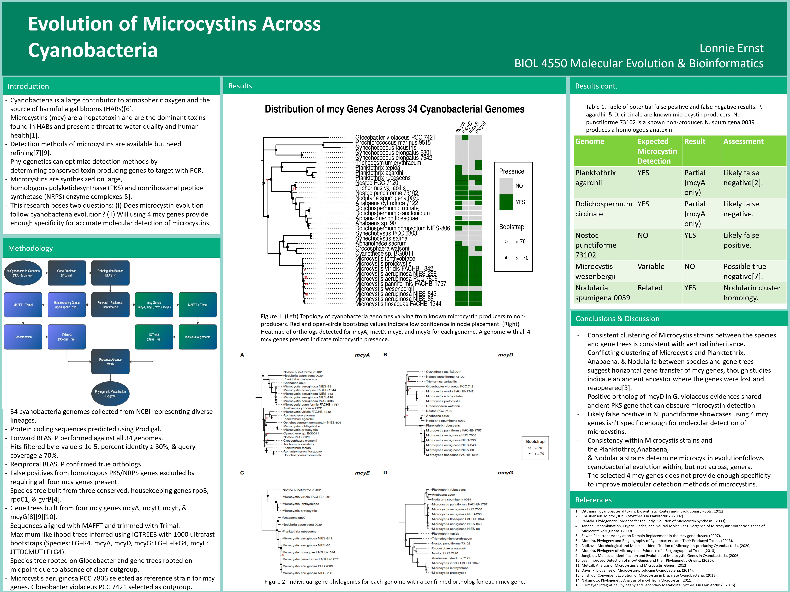

Lab Experience & Projects

<nav class="research-nav">

Projects

<a href="research-bph.html">PCB Degradation</a>
<a href="research-mars.html">Mars O2 Production</a>
<a class="active" href="research-phylo.html">Lab Experience</a>
</nav>

A collection of shorter-term projects and discrete laboratory experiences that span molecular biology, genomics, data analysis, and biomanufacturing.

Microcystin Phylogenetics

Genomics

*This project was for a coursework final. The research investigated molecular detection methods for identifying microcystin toxin genes mcyA, mcyD, mcyE, and mcyG. Microcystins can be difficult to identify and this research explored if using a range of mcy genes would provide enough specificity to reliably detect mcy genes with PCR. In this project, I downloaded cyanobacterial genomes using NCBI datasets and performed sequence analysis by comparing BLAST hits to a reference gene sequence for each of the mcy genes. Analysis revealed that the selected mcy genes fall short of providing a specific detection method as particular mcy genes were identified in species that are not known to carry mcy genes, and some other species were missing the mcy gene despite being known to carry them. This details the methods used and phylogenetic trees to visualize which species carried the selected genes. This poster was presented at UVU's end of semester biology research presentation April 2026.*

<a href="images/phylo-poster.pdf" target="_blank" rel="noopener">View poster (PDF)</a>

pGAL-GFP Expression in Yeast

Molecular Biology

*[Placeholder — one paragraph: the broader PETase-MHETase plastic degradation project context, your specific task (transforming yeast with the pGAL-GFP plasmid), and the GFP expression confirmation under the galactose promoter.]*

Taq Polymerase Production

Biomanufacturing

*[Placeholder — one paragraph: the STUDENTfacturED context, IPTG induction, SDS-PAGE verification of protein expression, and the Inoue competent cell preparation SOP you developed.]*

Sonic Game Data Analysis

Data Analysis

*[Placeholder — one paragraph: the course context, what you analyzed (critic/fan scores, sales, music), tools used (R), and key findings. Link to the full project below.]*

<a href="final_project.html">View full project</a>

