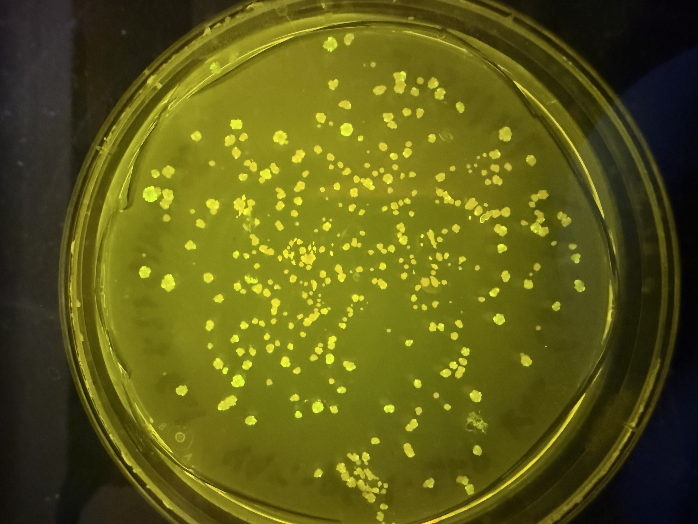
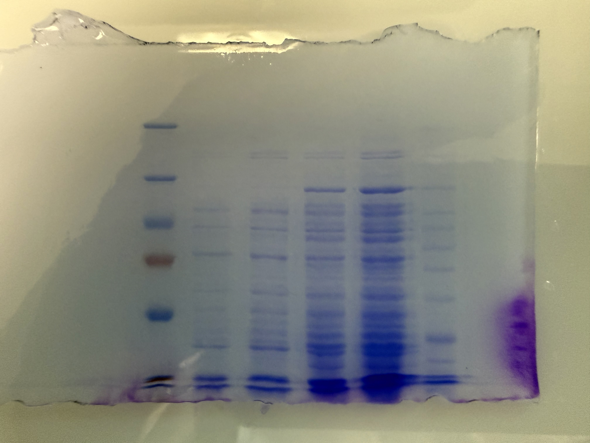

Lab Experience & Projects

<nav class="research-nav">

Projects

<a href="research-bph.html">PCB Degradation</a>
<a href="research-mars.html">Mars O2 Production</a>
<a class="active" href="research-phylo.html">Lab Experience</a>
</nav>

A collection of shorter-term projects and discrete laboratory experiences that span molecular biology, genomics, data analysis, and biomanufacturing.

Microcystin Phylogenetics

Genomics

Microcystins are cyanobacterial toxins that can be difficult to detect reliably due to their genetic variability across species. This project investigated whether targeting a panel of mcy genes (mcyA, mcyD, mcyE, and mcyG) using PCR would provide sufficient specificity for molecular detection. Cyanobacterial genomes were downloaded via NCBI Datasets and BLAST was used to compare hits against reference sequences for each target gene. Analysis revealed significant limitations: certain mcy genes were detected in species not known to carry them, while other known carriers were missing them entirely, indicating the selected panel lacks the specificity needed for reliable detection. Results were compiled into a research poster with phylogenetic trees visualizing gene distribution across species and presented at UVU's Biology Research Symposium in April 2026.

<a href="images/phylo-poster.pdf" target="_blank" rel="noopener">View poster (PDF)</a>

pGAL-GFP Expression in Yeast

Molecular Biology

An ongoing project at InnovaBio aimed to engineer yeast to express PETase-MHETase, enzymes capable of breaking down polyethylene terephthalate (PET) plastic and generating biofuel. Successful transformation was to be confirmed using two markers: the KanMX resistance cassette for selection and GFP expressed from the pGAL-GFP vector as a fluorescence reporter. This step had proven difficult for student researchers, so I stepped in to troubleshoot. YPH499 yeast cells were grown on YPD for recovery, then plated on synthetic dropout medium supplemented with G418 and 2% galactose, G418 being necessary since kanamycin is ineffective in yeast, to select for transformed colonies and induce GFP expression from the GAL promoter. Colony fluorescence was confirmed under UV light, providing student interns with a verified working protocol and a reliable starting point to continue the project.

Taq Polymerase Production

Biomanufacturing

Biology labs at SLCC currently rely on commercial Taq polymerase for PCR coursework, representing a significant recurring cost. This ongoing StudentFactured project aims to produce Taq in-house as a cost-saving measure. A plasmid carrying the Taq gene was transformed into E. coli BL21(DE3), and a positive colony was confirmed by miniprep and restriction digest. A starter culture was scaled to 50 mL, grown to an OD600 of ~0.7, and induced overnight with IPTG. Successful expression was confirmed by SDS-PAGE following cell lysis and sonication. Purification proceeded through a multi-step column-free protocol: a heat clearance step at 75°C to precipitate thermolabile host proteins (exploiting Taq's thermostability), streptomycin sulfate precipitation to remove nucleic acids, and sequential ammonium sulfate cuts at 35% and 75% saturation to isolate the protein fraction. The resulting pellet was resuspended in storage buffer, dialyzed overnight to remove residual ammonium sulfate, then aliquoted in 50% glycerol and stored at -80°C. Final SDS-PAGE verification of the purified protein is pending before production is scaled up through StudentFactured, potentially saving the college thousands of dollars annually.

<!--

Sonic Game Data Analysis

Data Analysis

*[Placeholder — one paragraph: the course context, what you analyzed (critic/fan scores, sales, music), tools used (R), and key findings. Link to the full project below.]*

<a href="final_project.html">View full project</a>

-->

