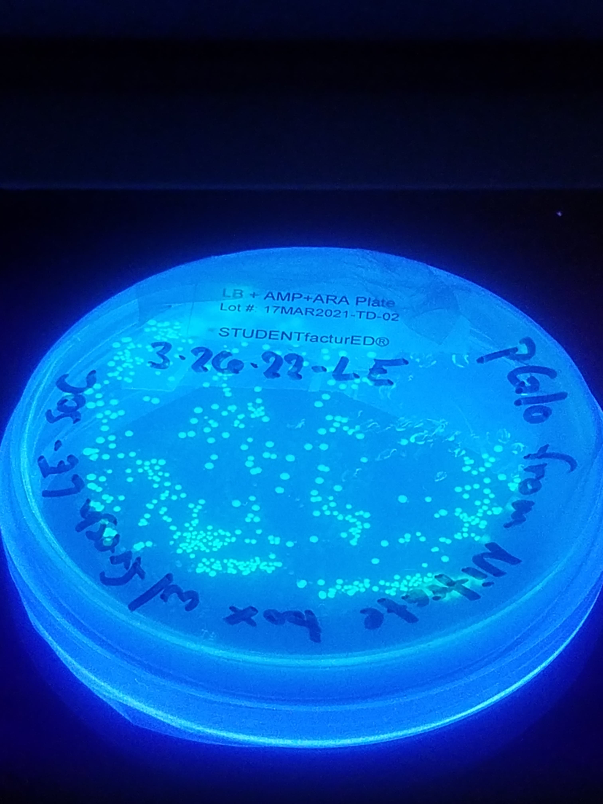

Research Projects

An overview of my current and past research. Each project explores a different intersection of molecular biology and real-world application.

<a class="research-card" href="research-bph.html">

Engineering Cyanobacteria to Degrade PCBs

Modifying cyanobacteria to break down persistent organic pollutants while suppressing toxin production.

</a>
<a class="research-card" href="research-mars.html">

Cyanobacterial Oxygen Production Under Simulated Mars Conditions

Investigating cyanobacterial growth as a foundation for oxygen and biomass production off-world.

</a>
<a class="research-card" href="research-phylo.html">

Lab Experience & Projects

Shorter-term work spanning phylogenetics, yeast transformation, protein production, and data analysis.

</a>